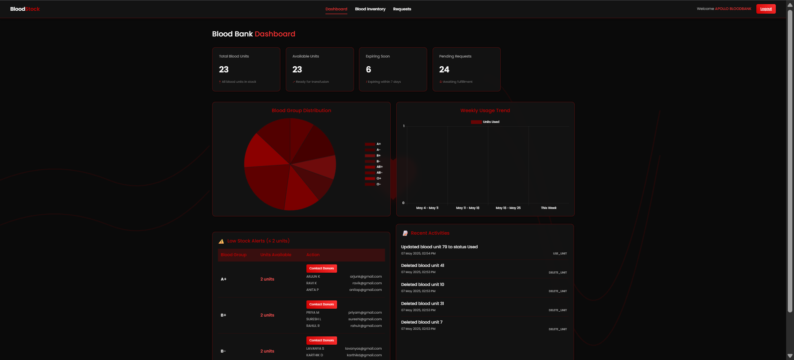
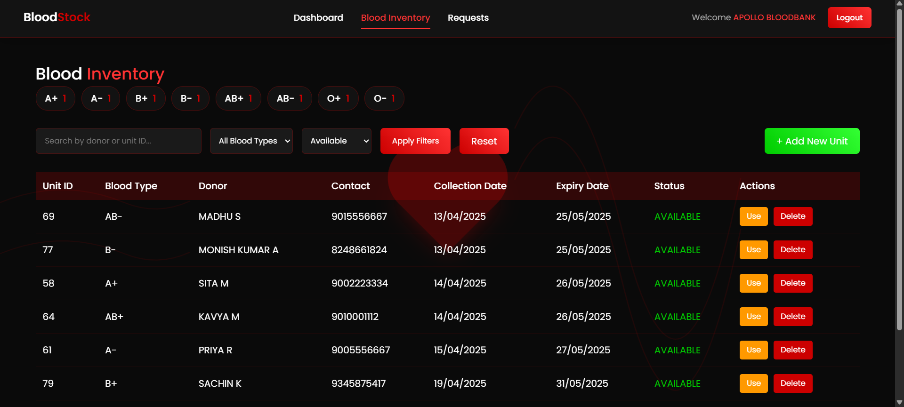
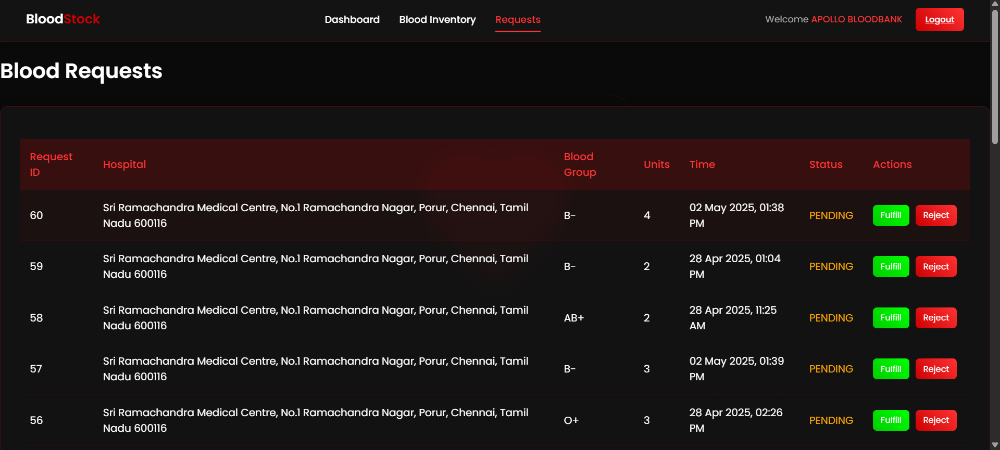

<h1 align="center" style="color:#FF4444;">🩸 BloodStock Management System</h1>

  

  
  
  
  

---

## 🧠 Overview

**BloodStock Management System (BSMS)** is a locally hosted web application built with PHP and MySQL. It simulates the real-time management of blood inventory with features like donor history, hospital blood requests, stock threshold alerts, expiry tracking, and simulated donor notifications — all bundled into a sleek dashboard.

---

## 📸 Screenshots

### 🔐 Login Page

  

---

### 📊 Dashboard Overview

  

---

### 🩸 Blood Inventory Table

  

---

### 🏥 Hospital Request Simulation

  

---

## ⚙️ Features

- 🩸 **Add & Track Blood Units:** Input donor details, blood group, expiry date, and quantity.
- 🕒 **Auto-Expiry Check:** System auto-detects and marks expired units.
- 📉 **Low-Stock Alerts:** Configurable thresholds for each blood group.
- 🏥 **Hospital-Side Requests:** Dummy hospital interface to simulate urgent needs.
- 🔔 **Donor Alert Simulation:** Suggests past donors when stocks run low.
- 📈 **Analytics:** Blood group-wise charts, usage logs, and expiry reports.

---

## 💻 Technologies Used

| Layer       | Stack                      |
|-------------|----------------------------|
| Frontend    | HTML, CSS, JavaScript (AJAX) |
| Backend     | PHP                         |
| Database    | MySQL                       |
| Charts      | Chart.js                    |
| Hosting     | Localhost (XAMPP/WAMP)      |

---

## 🛠️ Setup Instructions

git clone https://github.com/Sripramod-Y/Blood-Stock-Management.git
Import SQL:
Open MySQL and import the Bloodstock.sql file.

Set Up Config:
Edit config.php like this:

    $host = 'localhost';
    $username = 'root';
    $password = '';
    $db_name = 'bloodstock';

Run Locally:

Launch Apache & MySQL in XAMPP/WAMP.

Visit http://localhost/BSMS/index.php. (BSMS - Project root folder inside C:/xammp/htdocs/BSMS

🚀 Future Enhancements
📲 Mobile-friendly dark UI

📧 Real email/SMS notifications (Twilio/SMTP)

🔐 Role-based login for hospitals & donors

🔮 AI-based demand prediction

🧪 Project Status
✔️ Core modules working
🧪 Tested with dummy data
📌 Hosted on localhost only

# 📥 Installing Dependencies
📦 Dependencies:
PHPMailer (included in /vendor folder manually)
No Composer required.
And Replace the username and password in contact-donors.php 

  
 
 Built  by <strong>Sripramod</strong>  CSE @ Anna University | 2025 
 
